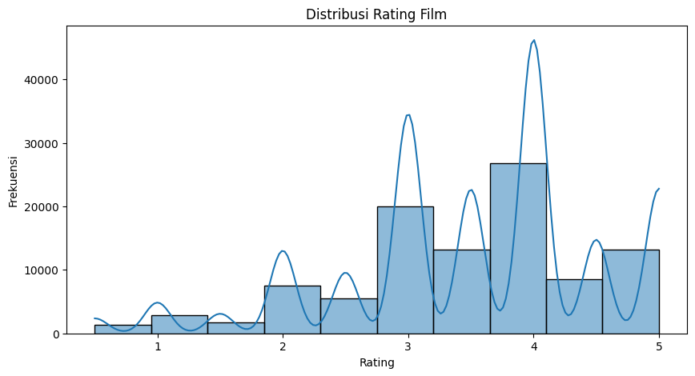
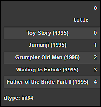
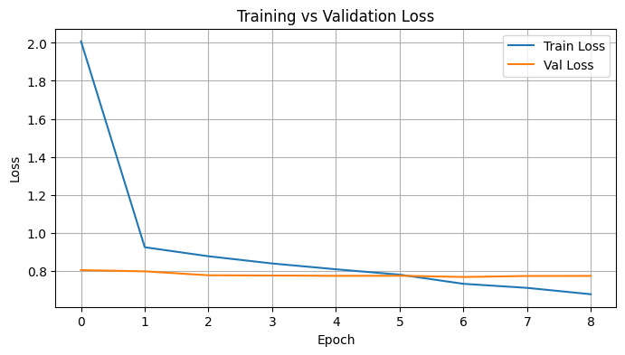
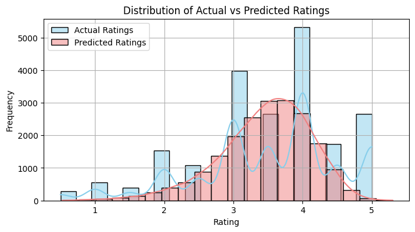
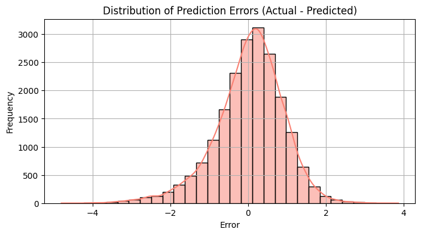

# **Laporan Proyek Machine Learning \- Muhammad Nur Alfin Huda**
# **Sistem Rekomendasi Film**

## **Project Overview**

Sistem rekomendasi telah menjadi komponen penting dalam banyak platform digital, termasuk e-commerce, layanan streaming musik, dan platform konten video seperti Netflix dan YouTube.  Dalam industri film, di mana ribuan judul film baru diluncurkan setiap tahun dan katalog film yang ada sangat banyak, pelanggan sering kali menghadapi tantangan untuk menemukan film yang sesuai dengan preferensi mereka.  Batas waktu dan banyaknya pilihan dapat membuat konsumen merasa kewalahan (*choice overload*), sehingga menurunkan keterlibatan dan kepuasan pengguna.

Proyek ini sangat penting untuk diselesaikan karena sistem rekomendasi film yang sangat baik dapat bermanfaat bagi pengguna dan penyedia layanan.  Pengguna mendapat manfaat dari sistem ini karena memudahkan mereka untuk mengidentifikasi film yang relevan dan menarik secara pribadi, meningkatkan pengalaman menonton, dan memungkinkan mereka menemukan film baru yang mungkin terlewatkan.  Bagi penyedia layanan, algoritme rekomendasi dapat meningkatkan keterlibatan pengguna, waktu yang dihabiskan di platform, dan loyalitas pelanggan.  Aplikasi dapat meningkatkan metrik bisnis seperti jumlah penonton dan retensi pengguna dengan memberikan rekomendasi yang dapat diandalkan yang mengarahkan pengguna ke konten yang mereka sukai.

Riset terkait menunjukkan bahwa penggunaan algoritma *hybrid* (menggabungkan beberapa teknik rekomendasi) seringkali memberikan hasil yang lebih baik daripada penggunaan satu algoritma tunggal. Sebagai contoh, penelitian oleh Adomavicius dan Tuzhilin (2005) membahas berbagai pendekatan dalam sistem rekomendasi dan tantangannya. Dataset yang digunakan dalam proyek ini, MovieLens, adalah dataset benchmark yang populer dan sering digunakan dalam penelitian sistem rekomendasi (Harper & Konstan, 2015), yang disediakan oleh GroupLens research lab dari University of Minnesota.

Referensi:

* Adomavicius, G., & Tuzhilin, A. (2005). Toward the Next Generation of Recommender Systems: A Survey of the State-of-the-Art and Possible Extensions. *IEEE Transactions on Knowledge and Data Engineering*, 17(6), 734-749.  
* Harper, F. M., & Konstan, J. A. (2015). The MovieLens Datasets: History and Context. *ACM Transactions on Interactive Intelligent Systems (TiiS)*, 5(4), 1-19. Artikel 19\.

## **Business Understanding**

Proses klarifikasi masalah dalam pengembangan sistem rekomendasi film ini melibatkan pemahaman terhadap kebutuhan pengguna untuk menemukan film yang relevan secara efisien dan keinginan platform untuk meningkatkan interaksi pengguna.

### **Problem Statements**
* Pengguna kesulitan menemukan film yang sesuai dengan selera dan preferensi unik mereka di tengah katalog film yang sangat besar.  
* Penyedia layanan ingin meningkatkan keterlibatan pengguna dan durasi menonton di platform dengan menyajikan konten yang paling relevan bagi setiap individu.  
* Bagaimana cara memberikan rekomendasi film yang beragam namun tetap personal, sehingga pengguna tidak hanya mendapatkan film yang mirip dengan yang sudah ditonton, tetapi juga menemukan genre atau tema baru yang menarik?

### **Goals**
* Mengembangkan sistem rekomendasi yang mampu menyarankan film kepada pengguna berdasarkan kemiripan konten film (genre, tag).  
* Mengembangkan sistem rekomendasi yang mampu memprediksi rating atau preferensi pengguna terhadap film berdasarkan perilaku pengguna lain yang serupa (pola rating).  
* Menyediakan daftar top-N film yang direkomendasikan untuk pengguna atau berdasarkan film tertentu.

### **Solution statements**
Untuk mencapai tujuan tersebut, diajukan dua pendekatan solusi (algoritma atau pendekatan sistem rekomendasi):
1. **Content-Based Filtering**: Pendekatan ini  merekomendasikan item kepada pengguna berdasarkan kesamaan fitur antar item dan preferensi pengguna terhadap item-item sebelumnya.
    * Cara Kerja:
        - Ekstraksi fitur: Setiap item memiliki atribut yang digunakan untuk membuat profilnya (misalnya, genre film, aktor, durasi).
        - Pembuatan profil pengguna: Sistem menganalisis item yang pernah dipilih pengguna dan membangun preferensi berdasarkan fitur yang sering dipilih.
        - Pencocokan item baru: Sistem mencari item lain yang memiliki fitur serupa dengan yang disukai pengguna dan merekomendasikannya.

    Dalam proyek ini, fitur seperti genre dan tag film akan digunakan untuk menghitung kemiripan antar film menggunakan TF-IDF Vectorizer dan Cosine Similarity. 
    
2. **Collaborative Filtering**: Pendekatan ini merekomendasikan item berdasarkan pola interaksi antar pengguna. Model mencari pengguna atau item yang punya pola perilaku serupa.
    * Cara Kerja:
        - User-based Collaborative Filtering: Mencari pengguna lain yang memiliki kesamaan dalam preferensi dan merekomendasikan item yang disukai mereka.
        - Item-based Collaborative Filtering: Menganalisis pola kesamaan antar item berdasarkan perilaku banyak pengguna, lalu merekomendasikan item yang sering dipilih bersama.

    Secara spesifik, akan digunakan *Neural Collaborative Filtering (NCF)*, sebuah model berbasis jaringan saraf tiruan yang dapat menangkap interaksi non-linear antara pengguna dan item (film) untuk memprediksi rating.

## **Data Understanding**

Dataset yang digunakan untuk proyek ini berasal dari GroupLens: [MovieLens Latest Datasets (Small)](https://grouplens.org/datasets/movielens/latest/). Dataset yang dipilih adalah "Small" yang direkomendasikan untuk tujuan edukasi dan pengembangan.

Dataset terdiri dari beberapa file CSV:

* movies.csv: Berisi informasi tentang film.  
* ratings.csv: Berisi informasi rating yang diberikan pengguna untuk film.  
* tags.csv: Berisi tag yang diberikan pengguna untuk film.

Informasi Jumlah dan Kondisi Data:  
Berdasarkan analisis pada notebook:

* **movies.csv**:  
  * Jumlah baris pada data movies: 9742 baris
  * Jumlah kolom pada data movies: 3 kolom
  * Jumlah film unik (berdasarkan movieId): 9742  
* **ratings.csv**:  
  * Jumlah baris pada data ratings: 100836 baris
  * Jumlah kolom pada data ratings: 4 kolom
  * Jumlah film dengan rating: 9724
  * Jumlah film tanpa rating: 18 (9742 \- 9724\)    
* **tags.csv**:  
  * Jumlah baris pada data tags: 3683 baris
  * Jumlah kolom pada data tags: 4 kolom
  * Jumlah film dengan tag: 1572
  * Jumlah film tanpa tag: 8170 (9742 \- 1572\)


Ini menunjukkan bahwa tidak semua film memiliki rating dan mayoritas film tidak memiliki tag. Pemeriksaan awal pada notebook menunjukkan tidak ada nilai null pada kolom-kolom utama dataset yang digunakan (movies.csv, ratings.csv, tags.csv) setelah loading awal, dan tidak ada data duplikat yang terdeteksi pada masing-masing file.

**Variabel-variabel pada dataset yang digunakan:**

1. **movies.csv**:  
   * movieId: ID unik untuk setiap film (Integer).  
   * title: Judul film, termasuk tahun rilis (String).  
   * genres: Genre film, dipisahkan oleh karakter | (String). Contoh: "Adventure|Animation|Children|Comedy|Fantasy".  
2. **ratings.csv**:  
   * userId: ID unik untuk setiap pengguna (Integer).  
   * movieId: ID unik untuk film yang dirating (Integer).  
   * rating: Rating yang diberikan pengguna untuk film (Float, skala 0.5 hingga 5.0, dengan interval 0.5).  
   * timestamp: Waktu pemberian rating (Integer, dalam detik sejak epoch).  
3. **tags.csv**:  
   * userId: ID unik pengguna yang memberikan tag (Integer).  
   * movieId: ID unik film yang diberi tag (Integer).  
   * tag: Teks tag yang diberikan oleh pengguna (String).  
   * timestamp: Waktu pemberian tag (Integer, dalam detik sejak epoch).

Exploratory Data Analysis (EDA) \- Visualisasi Data:  
Distribusi rating film dianalisis untuk memahami bagaimana user umumnya menilai film.  
\# Visualisai distribusi rating film  
    

Insight dari visualisasi:  
Dari grafik distribusi rating (seperti yang divisualisasikan dalam notebook), terlihat bahwa user cenderung memberikan rating tinggi, dengan rating 4.0 menjadi yang paling sering diberikan, diikuti oleh rating 3.0 dan 5.0. Rating rendah (misalnya, 0.5; 1.0; 1.5) lebih jarang diberikan. Ini menunjukkan bahwa secara umum, user lebih sering memberikan penilaian positif atau netral terhadap film yang mereka tonton.

## **Data Preparation**

Tahapan persiapan data dilakukan untuk memastikan data siap digunakan untuk pemodelan. Berikut beberapa proses yang dilakukan:

1. **Pra-pemrosesan Teks pada Fitur genres dan tag**:  
   * **Proses**:  
     * Pada fitur genres di movies.csv, karakter | yang memisahkan genre diubah menjadi spasi. Ini dilakukan agar setiap genre dapat diperlakukan sebagai kata terpisah.  
     * Teks pada kolom genres (setelah pengubahan |) dan tag (dari tags.csv) kemudian melalui serangkaian langkah pra-pemrosesan teks yang didefinisikan dalam fungsi preprocess\_text:  
       1. *Lowercase*: Semua teks diubah menjadi huruf kecil.  
       2. *Penghapusan Karakter Non-Alfabet*: Karakter selain huruf (seperti angka, tanda baca) dihilangkan dan diganti spasi.  
       3. *Tokenisasi*: Teks dipecah menjadi token (kata-kata individual).  
       4. *Lemmatization*: Setiap token diubah ke bentuk dasarnya (lemma) menggunakan WordNetLemmatizer dari NLTK.  
       5. *Penghapusan Stopwords*: Kata-kata umum dalam bahasa Inggris (misalnya, "the", "a", "is") dihilangkan menggunakan daftar stopwords dari NLTK.  
     * Kolom tag pada tags.csv yang memiliki nilai null (NaN) diisi dengan string kosong sebelum pra-pemrosesan untuk menghindari error.  
   * **Alasan**: Pra-pemrosesan teks bertujuan untuk membersihkan dan menstandarisasi data tekstual. Ini mengurangi noise, mengurangi dimensionalitas (jumlah kata unik), dan membantu model fokus pada kata-kata yang paling informatif. Lemmatization dan penghapusan stopwords meningkatkan kualitas representasi fitur teks yang akan digunakan oleh TF-IDF.

- Mengubah tanda '|' menjadi spasi pada genres 
movies['genres'] = movies['genres'].str.replace('|', ' ', regex=False)

- Preprocessing pada fitur genres 
movies['genres'] = movies['genres'].apply(preprocess_text)

- Preprocessing pada fitur tag (mengisi NaN sebelum apply)  
tags['tag'] = tags['tag'].fillna('').apply(preprocess_text)

2. **Menggabungkan Fitur Tag ke Data Movies**:  
   * **Proses**: Tag-tag yang relevan untuk setiap movieId dari tags.csv (yang sudah diproses) digabungkan menjadi satu string teks per film, dengan tag-tag dipisahkan spasi. Hasilnya kemudian digabungkan (merge) dengan dataframe movies berdasarkan movieId menggunakan left merge. Jika sebuah film tidak memiliki tag, kolom tag yang baru ditambahkan pada movies akan berisi string kosong (karena fillna('') sudah dilakukan sebelumnya pada tags dan fillna('') juga dilakukan setelah merge pada movies).  
   * **Alasan**: Ini dilakukan untuk mengkonsolidasikan semua informasi tekstual terkait konten (genre dan tag) ke dalam satu dataframe utama (movies), yang memudahkan pembuatan fitur gabungan untuk model content-based.
      

3. **Membuat Fitur Gabungan combined\_genre\_tag**:  
   * **Proses**: Kolom genres yang sudah diproses dan kolom tag yang sudah diproses (dan digabungkan ke movies) kemudian disatukan menjadi satu kolom baru bernama combined\_genre\_tag. Fungsi combine\_unique\_words digunakan untuk menggabungkan string dari kedua kolom tersebut dan memastikan bahwa kata-kata yang muncul adalah unik (menghilangkan duplikasi kata) sambil mempertahankan urutan kemunculan pertama.  
   * **Alasan**: Fitur gabungan ini menyediakan representasi teks yang lebih kaya dan komprehensif untuk setiap film, yang akan digunakan sebagai input utama untuk model Content-Based Filtering. Menghilangkan kata duplikat memastikan setiap konsep tidak diberi bobot berlebih hanya karena muncul di kedua sumber (genre dan tag).

      |index|movieId|title|genres|tag|combined\_genre\_tag|
      |---|---|---|---|---|---|
      |0|1|Toy Story \(1995\)|adventure animation child comedy fantasy|pixar pixar fun|adventure animation child comedy fantasy pixar fun|
      |1|2|Jumanji \(1995\)|adventure child fantasy|fantasy magic board game robin williams game|adventure child fantasy magic board game robin williams|
      |2|3|Grumpier Old Men \(1995\)|comedy romance|moldy old|comedy romance moldy old|
      |3|4|Waiting to Exhale \(1995\)|comedy drama romance||comedy drama romance|
      |4|5|Father of the Bride Part II \(1995\)|comedy|pregnancy remake|comedy pregnancy remake|

4. **TF-IDF Vectorizer**: Fitur combined\_genre\_tag dari setiap film diubah menjadi representasi vektor numerik. TF-IDF (Term Frequency-Inverse Document Frequency) memberikan bobot pada kata-kata berdasarkan frekuensinya dalam deskripsi satu film dan kelangkaannya di seluruh deskripsi film dalam dataset.

5. **Mapping Judul ke Indeks**: proses pembuatan kamus (mapping) antara judul film dan indeks numeriknya yang unik. Hal ini penting dilakukan untuk mengonversi data non-numerik (judul film) menjadi format numerik yang dapat digunakan oleh algoritma machine learning atau untuk pencarian dan pengolahan data yang lebih efisien. 

    

    Output yang ditampilkan memverifikasi bahwa setiap judul film telah berhasil dipetakan ke indeks numerik yang sesuai.

5. **Encoding userId dan movieId untuk Collaborative Filtering**:  
   * **Proses**: userId dan movieId dari ratings.csv yang bersifat kategorikal diubah menjadi representasi numerik integer yang berurutan (mulai dari 0). Ini dilakukan dengan membuat pemetaan (dictionary) dari ID asli ke ID yang di-encode, dan sebaliknya. Kolom baru user dan movie ditambahkan ke dataframe ratings yang berisi ID yang sudah di-encode. Jumlah pengguna unik (n\_users) dan film unik (n\_movies) juga dihitung.  
   * **Alasan**: Model Neural Collaborative Filtering (khususnya layer Embedding pada TensorFlow/Keras) memerlukan input berupa indeks integer untuk merepresentasikan pengguna dan item. Encoding ini mengubah ID kategorikal menjadi format yang sesuai untuk layer Embedding.

6. **Membagi Data untuk Training dan Validasi (Collaborative Filtering)**:  
   * **Proses**: Dataset ratings (yang sudah berisi user dan movie yang di-encode, serta rating) dibagi menjadi data training (80%) dan data validasi (20%) menggunakan train_test_split dari sklearn. Fitur input (x) adalah pasangan user, movie dan target (y) adalah rating.  
   * **Alasan**: Pembagian data ini penting untuk melatih model pada satu set data dan mengevaluasi kinerjanya pada set data yang tidak terlihat (data validasi). Ini membantu mengukur kemampuan generalisasi model dan mendeteksi/mencegah overfitting.


## **Modeling dan Result**

Dua pendekatan model sistem rekomendasi dikembangkan untuk menyelesaikan permasalahan: Content-Based Filtering dan Collaborative Filtering.

### **1. Content-Based Filtering**

Pendekatan ini merekomendasikan film berdasarkan kemiripan kontennya (genre dan tag).

* **Metode Perhitungan Kemiripan**:  
  1. **Cosine Similarity**: Kemiripan antar film dihitung berdasarkan matriks TF-IDF menggunakan metrik Cosine Similarity. Hasilnya adalah matriks kemiripan (similarity matrix) berukuran (jumlah film x jumlah film), di mana setiap sel (i,j) menunjukkan tingkat kemiripan antara film i dan film j.  
* **Proses Pembuatan Rekomendasi**:  
  1. Buat pemetaan dari judul film ke indeks barisnya dalam dataframe movies (dan matriks TF-IDF/Cosine Similarity).  
  2. Untuk judul film input tertentu (misalnya, ""**God Loves Caviar (2012"), temukan indeksnya.  
  3. Ambil baris yang sesuai dengan indeks tersebut dari matriks Cosine Similarity. Baris ini berisi skor kemiripan film input dengan semua film lain dalam dataset.  
  4. Pasangkan skor kemiripan ini dengan indeks film lain, lalu urutkan berdasarkan skor kemiripan secara menurun.  
  5. Ambil N film teratas (tidak termasuk film input itu sendiri) sebagai rekomendasi. 
* Data film, "God Loves Caviar (2012)":
  |index|movieId|title|genres|tag|combined\_genre\_tag|
  |---|---|---|---|---|---|
  |8964|136912|God Loves Caviar \(2012\)|adventure | |adventure| 

* Output Top-N Recommendation (Contoh dari script untuk "God Loves Caviar (2012)" dengan top_n=15): 
     ```
    🎬 Rekomendasi untuk "God Loves Caviar (2012)":
                            title                         genres        combined_genre_tag
          Beyond the Poseidon Adventure (1979)        [adventure]          adventure
                     White Water Summer (1987)        [adventure]          adventure
                              Iron Will (1994)        [adventure]          adventure
                  Mountains of the Moon (1990)        [adventure]          adventure
                             White Fang (1991)        [adventure]          adventure
                 Wind and the Lion, The (1975)        [adventure]          adventure
    Christopher Columbus: The Discovery (1992)       [adventure]          adventure
                        Treasure Island (2012)        [adventure]          adventure
                       God Loves Caviar (2012)        [adventure]          adventure
                              Neon Bull (2015)        [adventure]          adventure
                               Lamerica (1994) [adventure, drama]    adventure drama
          Robin Hood: Prince of Thieves (1991) [adventure, drama]    adventure drama
               Old Man and the Sea, The (1958) [adventure, drama]    adventure drama
                              Walkabout (1971) [adventure, drama]    adventure drama
                              Edge, The (1997) [adventure, drama]    adventure drama
    ```

  Film-film yang direkomendasikan seperti "Beyond the Poseidon Adventure (1979)", "White Water Summer (1987)", dan seterusnya memiliki genre yang sangat mirip (adventure) dengan "God Loves Caviar (2012)", yang menunjukkan bahwa model berhasil menangkap kesamaan konten.  
* **Kelebihan**:  
  * Tidak memerlukan data rating dari pengguna lain untuk merekomendasikan item (mengatasi *item* cold *start* jika fitur item tersedia).  
  * Dapat merekomendasikan item yang spesifik.  
  * Rekomendasi bersifat transparan karena didasarkan pada fitur item yang jelas dan dapat diinterpretasi.  
* **Kekurangan**:  
  * Keterbatasan fitur: Kualitas rekomendasi sangat bergantung pada kualitas dan kelengkapan fitur item yang diekstrak. Jika fitur tidak deskriptif, rekomendasi akan buruk.  
  * Kurang variasi (*overspecialization*): Cenderung merekomendasikan item yang sangat mirip dengan yang sudah disukai pengguna, kurang mampu mengeksplorasi item baru yang mungkin berbeda namun tetap disukai (kurang *serendipity*).  
  * Memerlukan *domain knowledge* untuk ekstraksi dan rekayasa fitur yang baik.

### **2. Collaborative Filtering (Neural Collaborative Filtering - NCF)**

Pendekatan ini merekomendasikan film berdasarkan pola rating dari pengguna serupa dan interaksi pengguna-film.

* **Arsitektur Model NCF:**  
  Model yang dibangun menggunakan Keras Functional API:  
  * **Input Layers**: Dua input terpisah, satu untuk user ID (integer yang sudah di-encode) dan satu untuk movie ID (integer yang sudah di-encode).  
  * **Embedding Layers**: Masing-masing input (user dan movie) dipetakan ke vektor embedding berdimensi EMBEDDING\_SIZE (diatur ke 50). Layer ini mempelajari representasi laten (vektor fitur) dari pengguna dan film.  
  * **Flatten Layers**: Output dari embedding layer di-flatten menjadi vektor 1D.   Ini mempersiapkan output dari embedding layer agar dapat digabungkan.
  * **Concatenate Layer**: Vektor embedding pengguna dan film yang sudah di-flatten digabungkan menjadi satu vektor tunggal.  Penggabungan ini menciptakan representasi gabungan dari interaksi antara pengguna tertentu dan film tertentu, menjadi masukan untuk lapisan-lapisan selanjutnya.
  * **Dense Layers**: Gabungan vektor dilewatkan melalui beberapa layer Dense (fully connected)
Fungsi dari Dense layer adalah mempelajari representasi gabungan dari user dan item.
    * Dense pertama (128 unit, aktivasi ReLU): Lapisan ini memiliki 128 neuron. Setiap neuron menerima input dari seluruh neuron di lapisan Concatenate sebelumnya.
    * Fungsi activation='relu': Fungsi aktivasi ReLU (Rectified Linear Unit), f(x)=max(0,x), diterapkan pada setiap neuron. ReLU memperkenalkan non-linearitas, memungkinkan jaringan untuk belajar pola yang lebih kompleks dan mengatasi masalah vanishing gradient yang sering terjadi pada jaringan yang dalam.
    * Dropout layer (rate 0.3): Setelah lapisan Dense pertama, diterapkan lapisan Dropout dengan tingkat 0.3.
Fungsi Dropout: Secara acak menonaktifkan 30% neuron di lapisan sebelumnya selama pelatihan. Ini adalah teknik regularisasi yang sangat efektif untuk mencegah overfitting,  
    * Dense kedua dengan 64 unit dan aktivasi ReLU. lapisan ini memiliki 64 neuron dan juga menggunakan aktivasi ReLU. Neuron-neuron di sini memproses output dari lapisan Dense sebelumnya.
    * Dropout layer (rate 0.3) untuk regularisasi.  
  * **Output Layer**: Satu neuron Dense tanpa fungsi aktivasi (implisitnya aktivasi linear) untuk memprediksi nilai rating (tugas regresi).  
  * **Optimizer**: Adam.  Algoritma Adam (Adaptive Moment Estimation) digunakan untuk memperbarui bobot (weights) jaringan selama pelatihan. secara otomatis menyesuaikan laju pembelajaran untuk setiap bobot berdasarkan rata-rata momen pertama (rata-rata gradien) dan momen kedua (rata-rata kuadrat gradien). Ini akan membuatnya sangat efisien dan efektif dalam menemukan nilai bobot optimal yang meminimalkan fungsi loss.
  * **Loss Function**: Mean Squared Error (MSE), digunakan sebagai fungsi loss. MSE mengukur rata-rata kuadrat perbedaan antara nilai rating yang diprediksi model dan nilai rating aktual. Memberikan penalti yang lebih besar untuk kesalahan prediksi yang lebih besar, mendorong model untuk membuat prediksi yang sangat dekat dengan nilai sebenarnya.
* **Proses Pelatihan:**  
  Model dilatih menggunakan pasangan (user_encoded, movie_encoded) sebagai input dan rating sebagai target. Data dibagi menjadi set training dan validasi. Callback EarlyStopping digunakan untuk menghentikan pelatihan jika val_loss tidak membaik setelah 2 epoch (patience=2) dan mengembalikan bobot terbaik. ReduceLROnPlateau digunakan untuk mengurangi learning rate sebesar faktor 0.5 jika val_loss tidak membaik setelah 1 epoch (patience=1). Model dilatih selama maksimal 15 epoch dengan batch_size=256. 
batch_size adalah jumlah contoh data (samples) yang diproses sekaligus dalam satu kali iterasi forward dan backward pass saat training model neural network. Dengan batch_size=256 maka setiap iterasi training, model akan memproses 256 sampel (kombinasi user dan film) sekaligus sebelum memperbarui bobot jaringan.
* **Output**: 
    Model NCF ini menghasilkan prediksi rating untuk pasangan (pengguna, film) tertentu. Untuk menghasilkan Top-N recommendation bagi seorang pengguna (tidak secara eksplisit diimplementasikan di notebook untuk output Top-N, namun merupakan langkah logis berikutnya), model dapat digunakan untuk memprediksi rating untuk semua film yang belum ditonton oleh pengguna tersebut. Kemudian, film-film tersebut diurutkan berdasarkan prediksi rating tertinggi untuk mendapatkan N film teratas.  
    * Pada proses pelatihan awal mendapatkan loss dan val_loss sebagai berikut:
        
        * Model NCF berhasil dilatih dengan baik tanpa overfitting, bahkan sejak epoch awal.
        * Model mampu generalisasi ke data baru, ditunjukkan oleh validation loss yang tetap rendah dan stabil.
        * Parameter pelatihan yang digunakan (dropout, batch size, optimizer) sudah cukup efektif dalam membimbing proses training.
        * Dengan ini model siap digunakan untuk memberikan rekomendasi, karena performa pada data validasi sudah mendekati optimal.

* **Hasil Rekomendasi**: 
    Contoh hasil rekomendasi Top-N untuk user_id=1 dan top_n=15 dengan Collaborative Filtering:
    |index|movieId|title|genres|predicted\_rating|
    |---|---|---|---|---|
    |852|1123|Perfect Candidate, A \(1996\)|documentary|5\.574831|
    |3294|4454|More \(1998\)|animation drama sci fi imax|5\.505291|
    |3505|4789|Phantom of the Paradise \(1974\)|comedy fantasy horror musical thriller|5\.489899|
    |5696|27776|Red Lights \(Feux rouges\) \(2004\)|drama|5\.480844|
    |6678|57843|Rise of the Footsoldier \(2007\)|action crime drama|5\.479981|
    |6697|58301|Funny Games U\.S\. \(2007\)|drama thriller|5\.474942|
    |6762|59814|Ex Drummer \(2007\)|comedy crime drama horror|5\.468338|
    |6920|64501|Che: Part Two \(2008\)|drama war|5\.460264|
    |6999|67618|Strictly Sexual \(2008\)|comedy drama romance|5\.454700|
    |7047|69211|Boy Eats Girl \(2005\)|comedy horror|5\.444162|
    |7199|72692|Mickey's Once Upon a Christmas \(1999\)|animation comedy fantasy|5\.440337|
    |7252|74282|Anne of Green Gables: The Sequel (a\.k\.a\. Anne of Avonlea\) \(1987\)|child drama romance|5\.427153|
    |8019|97866|Imposter, The \(2012\)|documentary|5\.421744|
    |8397|110130|Nut Job, The \(2014\)|adventure animation child comedy|5\.404757|
    |8993|139640|Ooops\! Noah is Gone\.\.\. \(2015\)|animation|5\.399600|

    * Hasil rekomendasi ini menunjukkan kemampuan model Collaborative Filtering untuk "menemukan" film-film baru yang relevan dan berpotensi disukai oleh pengguna.
    * Rekomendasi ini bersifat personal, karena didasarkan pada interaksi historis pengguna tersebut (jika ada) dan pola yang dipelajari dari keseluruhan data rating pengguna-film. Model ini tidak bergantung pada fitur konten film (seperti genre atau tag secara eksplisit untuk proses pencocokan), melainkan pada kemiripan perilaku antar pengguna dan item.
* **Kelebihan**:  
  * Tidak memerlukan fitur item secara eksplisit; model belajar langsung dari interaksi pengguna-item (rating).  
  * Mampu menemukan hubungan yang kompleks dan tak terduga (*serendipity*) antara item dan pengguna, karena model dapat mempelajari fitur laten.  
  * Dapat bekerja dengan baik meskipun informasi tentang item terbatas, selama ada data interaksi yang cukup.  
* **Kekurangan**:  
  * *User/Item Cold Start*: Sulit memberikan rekomendasi untuk pengguna baru (tidak ada histori rating) atau item baru (belum ada yang merating), karena model bergantung pada data interaksi historis.  
  * *Data Sparsity*: Kinerja dapat menurun jika matriks interaksi pengguna-item sangat jarang (banyak pengguna hanya merating sedikit item, atau banyak item hanya dirating oleh sedikit pengguna).  
  * Kurang transparan (*black box*): Sulit untuk menjelaskan secara intuitif mengapa suatu item direkomendasikan, karena rekomendasi didasarkan pada fitur laten yang dipelajari.

## **Evaluation**

Metrik evaluasi yang digunakan disesuaikan dengan jenis model rekomendasi yang dibangun dan tujuan dari masing-masing model.

### **1\. Collaborative Filtering (Neural Collaborative Filtering \- NCF)**

* **Metrik**: Root Mean Squared Error (RMSE)  
  * Formula: RMSE=N1​∑i=1N​(yi​−y^​i​)2​  
    Di mana:  
    * N adalah jumlah total prediksi pada set data evaluasi.  
    * yi​ adalah rating aktual untuk observasi (pasangan pengguna-film) ke-i.  
    * y^​i​ adalah rating yang diprediksi oleh model untuk observasi ke-i.  
  * **Cara Kerja**: RMSE mengukur akar dari rata-rata kuadrat perbedaan antara nilai aktual dan nilai prediksi. Metrik ini memberikan gambaran seberapa jauh rata-rata prediksi model dari nilai sebenarnya. Karena error dikuadratkan sebelum dirata-ratakan, RMSE memberikan bobot yang lebih besar pada error yang besar. Nilai RMSE yang lebih rendah menunjukkan kinerja model yang lebih baik dalam memprediksi rating.  
  * **Konteks**: Metrik ini sangat sesuai untuk model NCF karena model tersebut bertujuan untuk memprediksi nilai rating (sebuah tugas regresi). RMSE adalah metrik standar untuk mengevaluasi akurasi prediksi numerik dalam sistem rekomendasi.  
* **Hasil Proyek (NCF)**:  
  * Berdasarkan output notebook, setelah pelatihan model NCF, didapatkan **RMSE: 0.8761** pada data validasi.  
  * Nilai RMSE di bawah 1.0 pada skala rating 0.5-5.0 umumnya dianggap sebagai hasil yang cukup baik, menunjukkan bahwa model memiliki kemampuan prediksi yang lumayan akurat. Model berhenti pada epoch ke-9 karena EarlyStopping, dengan bobot terbaik dari epoch ke-7.

  Visualisasi hasil pelatihan (loss vs epoch) dan distribusi error prediksi:
        
        
        


  1. **Training vs Validation Loss**: Plot menunjukkan bahwa train\_loss dan val\_loss menurun seiring epoch dan konvergen, mengindikasikan model belajar dengan baik. EarlyStopping mencegah overfitting.  
  2. **Distribusi Rating Aktual vs. Prediksi**: Plot histogram menunjukkan bahwa distribusi rating yang diprediksi oleh model NCF berusaha mengikuti distribusi rating aktual. Meskipun prediksi model bersifat kontinu, pola umumnya tertangkap. 
  3. **Distribusi Error Prediksi**: Plot histogram error (selisih rating aktual dan prediksi) menunjukkan distribusi yang mendekati normal dan terpusat di sekitar 0\. Ini menandakan bahwa sebagian besar prediksi memiliki error yang kecil.

### **2\. Content-Based Filtering**

* **Metrik**: 
Untuk mengevaluasi model Content-Based Filtering, digunakan metrik **Precision@K, Recall@K, dan F1-Score@K**.
    * **Precision@K**: Mengukur proporsi item yang direkomendasikan dalam K item teratas yang relevan.
        Formula: $Precision@K = \frac{\text{Jumlah item relevan di K rekomendasi teratas}}{K}$
    * **Recall@K**: Mengukur proporsi item relevan yang berhasil direkomendasikan dalam K item teratas, dari semua item relevan yang ada.
        Formula: $Recall@K = \frac{\text{Jumlah item relevan di K rekomendasi teratas}}{\text{Total jumlah item relevan}}$
    * **F1-Score@K**: Rata-rata harmonik dari Precision@K dan Recall@K.
        Formula: $F1-Score@K = 2 \cdot \frac{Precision@K \cdot Recall@K}{Precision@K + Recall@K}$
    * **Cara Kerja**: Dalam notebook fungsi `recommend_and_evaluate` digunakan. Untuk film input (contoh: "God Loves Caviar (2012)"), sistem menghasilkan `top_n` rekomendasi. Item dianggap "relevan" jika skor cosine similarity-nya dengan film input melebihi `relevance_threshold` tertentu (dalam script, `relevance_threshold=0.8`).
    * top_n rekomendasi adalah jumlah rekomendasi teratas yang ingin ditampilkan atau di evaluasi.
    * threshold adalah nilai batas yang digunakan untuk menentukan apakah suatu item (misalnya, film, produk, artikel berita) layak direkomendasikan atau tidak kepada pengguna. Ini berfungsi sebagai filter, memastikan bahwa hanya item dengan tingkat kemiripan atau skor relevansi tertentu yang akan masuk daftar rekomendasi. Dalam konteks evaluasi disini (relevance_threshold=0.8), ini berarti sebuah film dianggap relevan jika skor kemiripannya dengan film referensi (atau film yang disukai pengguna) lebih besar atau sama dengan 0.8.
    * **Konteks**: Metrik ini membantu memahami seberapa akurat dan lengkap rekomendasi yang diberikan oleh sistem berdasarkan konten.

* **Evaluasi Hasil Proyek (Content-Based):**  
Evaluasi dilakukan menggunakan film "**God Loves Caviar (2012)**" dengan `top_n=15` dan `relevance_threshold=0.8`. Hasil yang diperoleh adalah:
    * **Precision@15: 0.9333**
    * **Recall@15: 0.1892**
    * **F1-Score@15: 0.3146**

    Interpretasi:
    * **Precision@15** Dari 15 item yang direkomendasikan, 93.33% di antaranya relevan (yaitu, memiliki kemiripan ≥ 0.8 dengan item referensi atau film yang disukai pengguna). Menghasilkan nilai yang tinggi (0.9333) menunjukkan bahwa sebagian besar dari 15 film yang direkomendasikan memang sangat mirip (berdasarkan threshold kemiripan konten) dengan "God Loves Caviar (2012)".
    * **Recall@15** Menghasilkan nilai yang lebih rendah (0.1892) mengindikasikan bahwa dari semua film yang dianggap relevan (similarity > 0.8) di seluruh dataset untuk "God Loves Caviar (2012)", model berhasil menemukan sekitar 18.92% di antaranya dalam 15 rekomendasi teratas.
    * **F1-Score@15** (0.3146) memberikan skor tunggal yang menyeimbangkan precision dan recall. Nilai 0.3146 ini menunjukkan bahwa ada ketidakseimbangan yang signifikan antara Precision dan Recall. Precision yang sangat tinggi, tetapi Recall rendah, sehingga F1-Score menjadi rendah. Ini menandakan bahwa model sangat "konservatif" (hanya merekomendasikan yang sangat yakin relevan).

### **Ringkasan Evaluasi**

* **Neural Collaborative Filtering (NCF)**: Menunjukkan kinerja yang baik dalam memprediksi rating pengguna dengan **RMSE 0.8761**. Ini berarti model ini efektif dalam menangkap preferensi laten pengguna berdasarkan histori rating.  
* **Content-Based Filtering**: Efektif dalam menemukan film dengan konten (genre dan tag) yang serupa. Untuk film "God Loves Caviar (2012)", model mencapai **Precision@15 sebesar 0.9333**, **Recall@15 sebesar 0.1892**, dan **F1-Score@15 sebesar 0.3146** (dengan `relevance_threshold=0.8`), yang menunjukkan bahwa rekomendasi yang dihasilkan sangat relevan secara semantik berdasarkan fitur teks yang digunakan.

Kedua model memiliki kekuatan masing-masing dan mengatasi aspek yang berbeda dari masalah rekomendasi. Model NCF baik untuk personalisasi berdasarkan perilaku historis, sedangkan Content-Based baik untuk rekomendasi berdasarkan atribut item yang eksplisit. Kombinasi keduanya (misalnya dalam sistem hybrid) berpotensi menghasilkan sistem rekomendasi yang lebih kuat dan fleksibel di masa depan.


